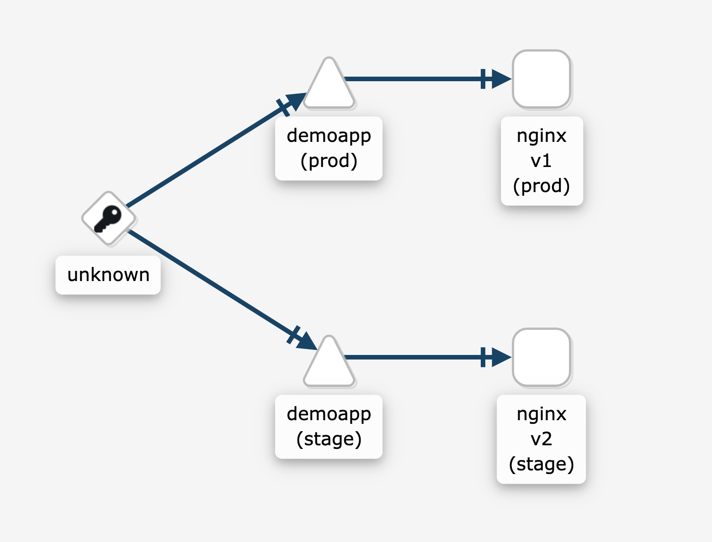

## istio-helm-deployment

This repository creates canary and blue/green deployment of a demo application with Istio and Helm on EKS

**This code contains the following resources**

- demo application helm chart
- basic istio configuration


**Prerequisites**
- EKS cluster running in AWS: https://docs.aws.amazon.com/eks/latest/userguide/create-cluster.html
- kubectl installed: https://kubernetes.io/docs/tasks/tools/install-kubectl/
- istio (at least 1.5) installed in the cluster: https://istio.io/docs/setup/install/istioctl/
- istioctl installed: https://istio.io/docs/setup/getting-started/
- Helm3 installed: https://helm.sh/docs/intro/install/

**Installation**
```shell
$ kubectl create namespace prod
$ kubectl create namespace stage
$ kubectl label namespace prod istio-injection=enabled
$ kubectl label namespace stage istio-injection=enabled
$ helm install demoappv1 helm-chart/demoapp/ --wait --set deployment.tag=v1 --namespace prod
$ helm install demoappv2 helm-chart/demoapp/ --wait --set deployment.tag=v2 --namespace stage
$ kubectl create -f istio-config/gateway.yaml
$ kubectl create -f istio-config/vsvc.yaml
```


If everything went good, you should be able to see in your kiali versioned graph the following:


---

## How it works 

The magic happens in the next two files that we applied earlier

```yaml
apiVersion: networking.istio.io/v1alpha3
kind: Gateway
metadata:
  name: app-gateway
spec:
  selector:
    istio: ingressgateway
  servers:
  - port:
      number: 80
      name: http
      protocol: HTTP
    hosts:
    - "*"
```
```yaml
apiVersion: networking.istio.io/v1alpha3
kind: VirtualService
metadata:
  name: demoapp
spec:
  hosts:
  - "*"
  gateways:
  - app-gateway
  http:
    - route:
      - destination:
          host: flaskapp.prod.svc.cluster.local 
        weight: 50
      - destination:
          host: flaskapp.stage.svc.cluster.local
        weight: 50
 ```
---
Gateway file applies a listening policy to the istio ingress-controller whereas virtualservice maps that gateway with the services we would like to destribute the traffic to.

**Contributor**
Nikolay Vaklinov
